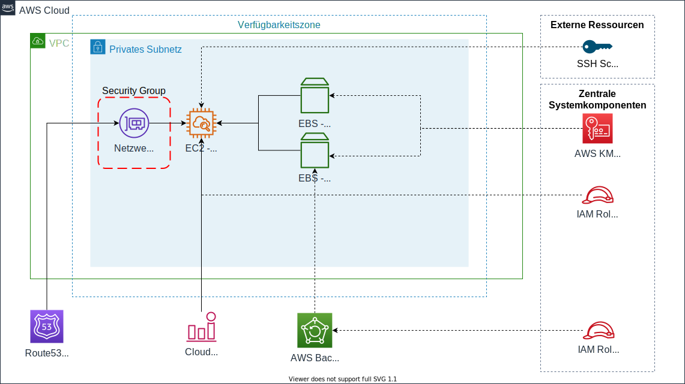

## Requirements

No requirements.

## Providers

| Name | Version |
|------|---------|
| aws | n/a |

## Inputs

| Name | Description | Type | Default | Required |
|------|-------------|------|---------|:--------:|
| ami | AWS AMI. | `string` | n/a | yes |
| backup\_role | IAM Role for AWS Backup. | `string` | n/a | yes |
| domain\_name | The domain name which should be used for the full qualified hostname resolution. | `string` | n/a | yes |
| filesystem\_backup\_plan | Role for the EC2 IAM Instance Profile. | `string` | n/a | yes |
| hostname | Hostname of the provided instance. | `string` | n/a | yes |
| instance\_role | Role for the EC2 IAM Instance Profile. | `string` | `null` | no |
| instance\_type | AWS Instance Type. | `string` | n/a | yes |
| kms\_key\_id | KMS Key for encryption. | `string` | `null` | no |
| sap\_instance\_number | Instance Number of the SAP instance. | `number` | n/a | yes |
| sap\_sid | SAP System identifier. | `string` | n/a | yes |
| ssh\_public\_key | SSH Key for the EC2-Instance. | `string` | n/a | yes |
| subnet\_id | Subnet ID to deploy the EC2 Instance. | `string` | n/a | yes |
| swap\_size | Size of the swap filesystem. | `number` | `32` | no |
| usrsap\_size | Size of the /usr/sap filesystem. | `number` | `50` | no |

## Outputs

No output.