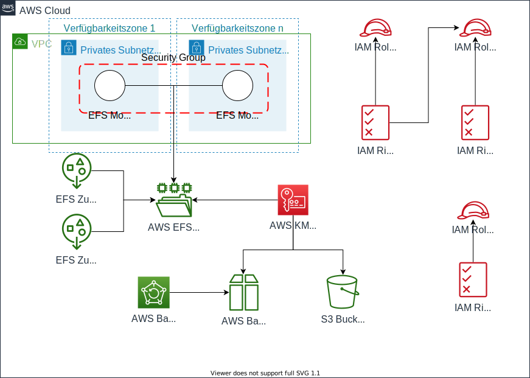

## Requirements

No requirements.

## Providers

| Name | Version |
|------|---------|
| aws | n/a |

## Inputs

| Name | Description | Type | Default | Required |
|------|-------------|------|---------|:--------:|
| backup\_schedule\_filesystems | (Cron-Expression) Schedule for the filesystem backups | `string` | `"cron(0 20 * * ? *)"` | no |
| sap\_sid | SAP System identifier | `string` | n/a | yes |
| vpc\_id | Private VPC | `string` | n/a | yes |

## Outputs

| Name | Description |
|------|-------------|
| backup\_plan\_filesystems | n/a |
| iam\_backup\_role | n/a |
| iam\_hanadb\_role | n/a |
| iam\_s4\_role | n/a |
| kms\_key | n/a |